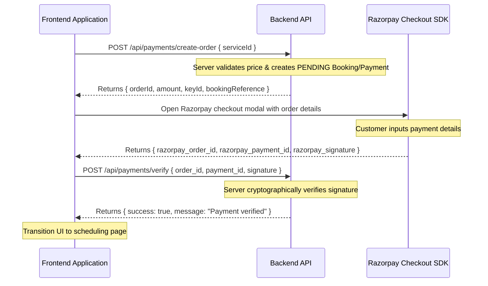

# Frontend Integration Guide

This guide is designed for the frontend development team to integrate with the backend API seamlessly. It details security constraints, credentials handling, state management, and multi-step third-party flows (Razorpay and Calendly).

---

## 1. Authentication & Cookie Management

The backend utilizes a secure, dual-token system for authentication:
- **Access Token:** Short-lived (15 minutes), returned in the JSON body of successful login requests. The frontend should store this in memory (React state) or in local storage.
- **Refresh Token:** Long-lived (7 days), set automatically by the backend inside an `HttpOnly`, `Secure` cookie named `refreshToken`. The frontend cannot read this cookie via JavaScript (protecting it from XSS).

### Crucial Axios / Fetch Config
Because the refresh token and logout commands rely on cookies, the frontend **MUST** configure its HTTP client to include credentials in every request:
- **Axios:** `axios.defaults.withCredentials = true;`
- **Fetch:** `fetch(url, { credentials: 'include', ... })`

*If this is omitted, the browser will not send the refresh token cookie, and all refresh/logout calls will return `401 Unauthorized` errors.*

---

## 2. CSRF (Cross-Site Request Forgery) Protection

To prevent cross-site request forgery on state-modifying cookie routes, the backend requires a custom header value to be present on `/api/auth/refresh`, `/api/auth/logout`, `/api/admin/auth/refresh`, and `/api/admin/auth/logout`.

- **Header Name:** `X-CSRF-Token`
- **Value:** The client must generate or provide a token value (or a static verification header token like `X-Requested-With` or a generated CSRF header). During request processing, the backend asserts the presence of this header.
- **Example implementation:**
  ```javascript
  axios.post('/api/auth/refresh', {}, {
    headers: {
      'X-CSRF-Token': 'csrf_custom_token_123'
    }
  });
  ```

---

## 3. Public Enquiry Spam Protection (Honeypot)

The `POST /api/enquiries` endpoint enforces spam protection using a honeypot field.
- The request body contains a field named `phone`.
- **Frontend Action:** Render the `phone` field in your enquiry form but hide it from human users using CSS (`display: none;` or `opacity: 0; positioning`).
- Human users will leave the field empty. Spam bots will scan the HTML form, identify the input, and fill it with values.
- If the backend receives an enquiry where the `phone` field is **not** empty, it classifies it as spam and silently discards it (returning 201 success but doing nothing). Ensure human users never fill this field.

---

## 4. Razorpay Payment Checkout Flow

The Razorpay payment flow is client-initiated but server-verified. Follow this exact workflow:



### Checkout Code Example
```javascript
// 1. Create order on backend
const orderRes = await axios.post('/api/payments/create-order', { serviceId: 'consulting-1h' });
const { orderId, amount, keyId, bookingReference } = orderRes.data;

// 2. Configure Razorpay SDK options
const options = {
  key: keyId,
  amount: amount,
  currency: 'INR',
  name: 'C2C Consulting',
  order_id: orderId,
  handler: async function (response) {
    // 3. Receive tokens and verify on backend
    try {
      const verifyRes = await axios.post('/api/payments/verify', {
        razorpay_order_id: response.razorpay_order_id,
        razorpay_payment_id: response.razorpay_payment_id,
        razorpay_signature: response.razorpay_signature
      });
      alert('Payment successful and verified!');
      // Proceed to Calendly scheduling
    } catch (err) {
      alert('Payment verification failed.');
    }
  }
};

const rzp = new window.Razorpay(options);
rzp.open();
```

---

## 5. Calendly Scheduling Flow

Once the customer has verified their payment, they must be redirected to Calendly to select a time slot.

### Step-by-Step Flow:
1. **Fetch Unlocked URL:** The frontend queries the customer's bookings list (`GET /api/me/bookings`).
2. **Retrieve Reference:** If the payment is `'SUCCESS'`, the booking will contain an `unlockedCalendlyUrl` field. This is the consultant's Calendly URL with the custom `bookingReference` pre-appended as a `utm_campaign` tracking parameter:
   `https://calendly.com/consultant/1h?utm_campaign=booking_a2f8b9d0c2e3f4a5b6c7d8e9f0a1b2c3`
3. **Open Scheduler:** Redirect the customer to this URL or open it in a Calendly scheduling iframe.
4. **Link Matching:** When the customer schedules a slot, Calendly sends an `invitee.created` webhook to the backend containing the UTM campaign tracking reference. The backend parses this reference, checks that the booking user matches the invitee email, and transitions the booking status to `'CONFIRMED'`.

*Warning: If the UTM campaign parameter is missing or stripped by browser plugins during redirect, the backend falls back to email matching. If the user has multiple pending paid bookings, both bookings are flagged as `'NEEDS_REVIEW'` to prevent incorrect linkage.*
